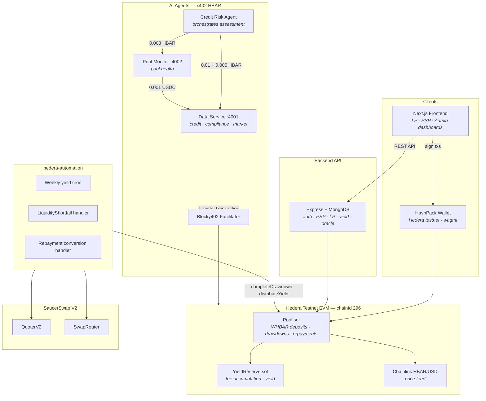

# HederaPay

**Live demo:** https://hederapay-web.onrender.com

HederaPay is a programmable credit pool on **Hedera testnet**. Licensed Payment Service Providers (PSPs) draw **WHBAR** instantly for corridor settlement. Institutional investors deposit WHBAR and earn a fixed **5% APY**. When a PSP applies for a credit line, AI agents autonomously assess risk by paying for data via **x402** micropayments — no subscriptions, no API keys, just signed HBAR transfers on-chain.

Liquidity gaps and repayment conversions are handled automatically by **hedera-automation** using **SaucerSwap V2** on Hedera EVM.

Built for the [Hedera x402 Bounty](https://hedera.com/x402-bounty/) — multi-agent economy where agents pay agents for data.

---

## The problem

Cross-border payment companies (PSPs) need working capital *now* to settle corridors — but traditional credit lines are slow, manual, and expensive to underwrite.

At the same time:

1. **Investors** want predictable yield on idle capital, not complex DeFi strategies
2. **PSPs** need instant drawdowns up to a credit limit, with flexible repayment (WHBAR or USDC)
3. **Underwriters** need real-time credit, compliance, and pool-health data — ideally without human-in-the-loop API billing
4. **The pool** must auto-handle liquidity shortfalls and route repayments through on-chain DEX when needed

HederaPay combines an on-chain WHBAR pool, automated yield distribution, SaucerSwap integration, and an x402 agent economy to solve all four.

---

## What you can do

### As an investor (LP)

| Action | What happens |
|---|---|
| Connect HashPack | Wallet on Hedera testnet (chainId 296) |
| Deposit WHBAR | Funds enter `Pool.sol`, start earning yield immediately |
| Track APY | Fixed 5% APY displayed in LP dashboard |
| Withdraw | Principal + accrued yield returned as WHBAR |

→ **Start Investing** at `/auth/investor`

### As a PSP (borrower)

| Action | What happens |
|---|---|
| Apply for liquidity | KYB onboarding form → admin review |
| Get credit assessed | Credit Risk Agent pays x402 APIs for score + compliance + pool health |
| Request drawdown | Instant WHBAR up to your drawdown limit from the pool |
| Repay | WHBAR directly, or USDC converted via SaucerSwap |

→ **Apply for Liquidity** at `/auth/psp`

### As an admin

| Action | What happens |
|---|---|
| Review PSP applications | Approve or reject KYB submissions |
| Monitor pool | Utilization, drawdowns, audit trail |
| Manage yield | Weekly distribution triggered by hedera-automation |

→ **Admin dashboard** at `/admin`

### As an AI agent (x402)

Agents buy and sell data autonomously. No credit card — just a funded Hedera testnet account and `@x402/hedera`.

**Sell side — Data Service** (port 4001):

| Endpoint | Price | Returns |
|---|---|---|
| `GET /api/agent/credit-score` | 0.01 HBAR | PSP credit score + factors |
| `GET /api/agent/compliance-check` | 0.005 HBAR | KYB / sanctions screening |
| `GET /api/agent/market-data` | 0.001 USDC | Stablecoin market rates (DeFiLlama) |

**Sell side — Pool Monitor** (port 4002):

| Endpoint | Price | Returns |
|---|---|---|
| `GET /api/agent/pool-health` | 0.003 HBAR | Utilization, liquidity risk, safe drawdown limit |

**Buy side — Credit Risk Agent** orchestrates a full assessment (~0.018 HBAR total):

```
1. Pay Pool Monitor ($0.003) → pool health analysis
2. Pay Data Service ($0.01)  → credit score for PSP address
3. Pay Data Service ($0.005) → compliance check
4. Combine scores → approve / reduced_limit / manual_review / decline
```

**Agent-to-agent:** Pool Monitor itself pays Data Service ($0.001 USDC) for market data before producing its analysis — a nested x402 economy.

```bash
cd agent
npm run data-service    # port 4001 — sell-side APIs
npm run pool-monitor    # port 4002 — pool health agent
npm run credit-risk     # demo: full assessment flow
npx tsx scripts/e2e-x402-pay.ts   # reproduce live payments
```

---

## How capital moves through the system

```
1. Investors deposit WHBAR into Pool.sol on Hedera EVM
        ↓
2. PSP applies → admin approves → credit line assigned
        ↓
3. Credit Risk Agent pays x402 APIs to score the PSP
        ↓
4. PSP requests drawdown → WHBAR transferred from pool
        ↓
5. If pool liquidity is short → LiquidityShortfall event fires
        ↓
6. hedera-automation sources WHBAR via SaucerSwap + completes drawdown
        ↓
7. PSP repays in WHBAR or USDC
        ↓
8. USDC repayments → SaucerSwap swap to WHBAR → processConvertedRepayment
        ↓
9. Weekly cron → YieldReserve distributes 5% APY to LPs
```

---

## Architecture



**Key design choices:**

- **WHBAR pool asset** — native Hedera wrapped HBAR for deposits, drawdowns, and yield
- **x402 for agent data** — each API call is a micropayment; agents only pay for data they consume
- **hedera-automation replaces Chainlink CRE** — cron + event listeners on Hedera JSON-RPC handle yield and liquidity
- **SaucerSwap for conversions** — USDC→WHBAR swaps when PSPs repay in stablecoin or pool needs topping up

---

## x402 payment flow

Per [Hedera x402 docs](https://docs.hedera.com/solutions/ai/x402):

1. Agent calls a protected endpoint → server returns **HTTP 402** with `hedera:testnet` payment requirements
2. `@x402/hedera` client builds a partially-signed `TransferTransaction` (native HBAR)
3. Blocky402 facilitator verifies, co-signs as fee payer, submits to consensus
4. Agent retries with payment proof → receives data
5. Transaction visible on [HashScan](https://hashscan.io/testnet)

---

## Quick start

**Prerequisites:** Node.js 20+, MongoDB, funded Hedera testnet accounts (deployer, seller, agent buyer).

```bash
cp .env.example .env
# Fund accounts: https://portal.hedera.com/faucet

cd contracts && npm install && npm run deploy:hedera
cd ../agent && npm install && npm run data-service    # terminal 1
cd ../hedera-automation && npm install && npm start   # terminal 2
cd ../backend && npm install && npm run dev           # terminal 3
cd ../frontend && npm install && npm run dev          # terminal 4
```

Connect **HashPack** on Hedera testnet. Pool operations use WHBAR via wagmi on `https://testnet.hashio.io/api`.

Full E2E verification:

```bash
bash scripts/e2e-verify.sh
```

---

## Verified on testnet

These are real x402 micropayments settled on Hedera testnet:

1. **Credit score (PSP Alpha):** https://hashscan.io/testnet/transaction/0.0.7162784@1785560595.640968335
2. **Compliance check (PSP Alpha):** https://hashscan.io/testnet/transaction/0.0.7162784@1785560598.767698917
3. **Pool health analysis:** https://hashscan.io/testnet/transaction/0.0.7162784@1785560606.366440529
4. **Credit score (PSP Beta):** https://hashscan.io/testnet/transaction/0.0.7162784@1785560610.801275749
5. **Compliance check (PSP Beta):** https://hashscan.io/testnet/transaction/0.0.7162784@1785560617.410916347

- **Buyer (agent):** https://hashscan.io/testnet/account/0.0.9769419
- **Seller (data service):** https://hashscan.io/testnet/account/0.0.9733389

Reproduce: `cd agent && npm run data-service` then `npx tsx scripts/e2e-x402-pay.ts`

---

## Project structure

```
HederaPay/
├── agent/                 # x402 agents — Data Service, Pool Monitor, Credit Risk
├── contracts/             # Pool.sol + YieldReserve.sol (Hardhat → Hedera EVM)
├── hedera-automation/     # Yield cron + SaucerSwap event handlers
├── backend/               # Express API + MongoDB
├── frontend/              # Next.js + HashPack + wagmi (hederaTestnet)
└── deploy/                # Oracle VM + Render deploy scripts
```

---

## Stack

| Layer | Technology |
|---|---|
| Smart contracts | Solidity 0.8, OpenZeppelin, Hardhat (Hedera testnet chainId 296) |
| Pool asset | WHBAR (`0xb1F616...`) |
| Wallet | HashPack via `@hashgraph/hedera-wallet-connect` + Reown AppKit |
| x402 payments | `@x402/hedera`, `@x402/express`, `@x402/axios`, Blocky402 facilitator |
| DEX | SaucerSwap V2 Router `0.0.1414040`, QuoterV2 `0.0.1390002` |
| Oracle | Chainlink HBAR/USD on Hedera testnet |
| Automation | `hedera-automation/` — node-cron + ethers event listeners |
| Backend | Express + MongoDB |
| Frontend | Next.js + wagmi + Tailwind |
| Explorer | [HashScan testnet](https://hashscan.io/testnet) |

---

## Configuration

See [`.env.example`](.env.example) for the full list. Essentials:

| Variable | Purpose |
|---|---|
| `HEDERA_ACCOUNT_ID` / `DEPLOYER_PRIVATE_KEY` | Contract deployer |
| `POOL_CONTRACT_ADDRESS` / `YIELD_RESERVE_ADDRESS` | Set after `npm run deploy:hedera` |
| `SELLER_ACCOUNT_ID` | Receives x402 agent payments |
| `HEDERA_CLIENT_ID` / `HEDERA_CLIENT_KEY` | Agent buyer account (pays for data) |
| `X402_FACILITATOR_URL` | Blocky402 testnet (`https://api.testnet.blocky402.com`) |
| `DATABASE_URL` | MongoDB connection |
| `REOWN_PROJECT_ID` | HashPack browser wallet |
| `SAUCERSWAP_QUOTER_EVM` / `SAUCERSWAP_ROUTER_EVM` | DEX integration |

---

## Deploy

| Target | How |
|---|---|
| **Render** | Blueprint from [`render.yaml`](render.yaml) — live at https://hederapay-web.onrender.com |
| **Oracle VM** | `deploy/deploy-to-oracle.sh` |

---

## Bounty submission

Demo script, verification commands, and submission proof → **[SUBMISSION.md](SUBMISSION.md)**

Additional docs: [TECHNICAL_SPEC.md](./TECHNICAL_SPEC.md) · [docs/architecture.md](./docs/architecture.md)

---

## Links

- [Hedera x402 docs](https://docs.hedera.com/solutions/ai/x402)
- [@x402/hedera SDK](https://github.com/x402-foundation/x402/tree/main/typescript/packages/mechanisms/hedera)
- [Blocky402 facilitator](https://api.testnet.blocky402.com/supported)
- [HashScan testnet explorer](https://hashscan.io/testnet)
- [SaucerSwap](https://docs.saucerswap.finance/)
- [Hedera testnet faucet](https://portal.hedera.com/faucet)
